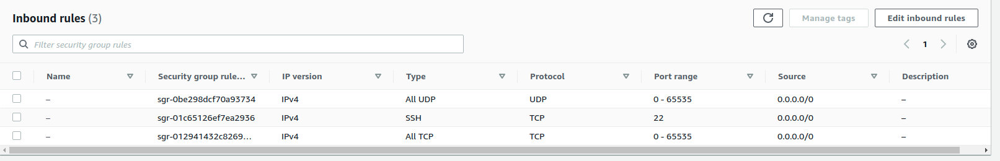
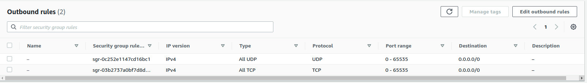

# eth-priv-net
This is a repo to create Private Ethereum Network on AWS using PoA.
It is an automation to start ,monitor and play with ethereum network.

## AWS setup
Inorder to setup the private ethereum network, we would like to have following configuration.
- a Boot node (It will be the node that will help on aiding the other ethereum nodes to discover each other)
- Ethereum Nodes (List of nodes where ethereum network will be running and maintain the chaindata)

You can chose any ec2/gc instance but ensure the security group appropriately setup. Ensure to open the tcp and udp ports for the interprocess communication.

Also ensure to create all nodes with same private key & security group for easier connectivity.

This setup will work with as minimum as one ethereum node without any pupeth work....

## Inputs
A Config file containing following parameter
`PEM_FILE=<path of pem file>
 SEAL_NODES=<comma separated list of ips to host eth net>
 BOOT_NODE=public ip of boot node`

## Working
It implements the automation in following manner.
1. It creates the necessary seal accounts on eth nodes
2. Prepares the genesis file based on seal accounts being created
3. Inits the bootnodes and extract the discovery enode.
4. Starts each of ethereum by copying the genesis file
